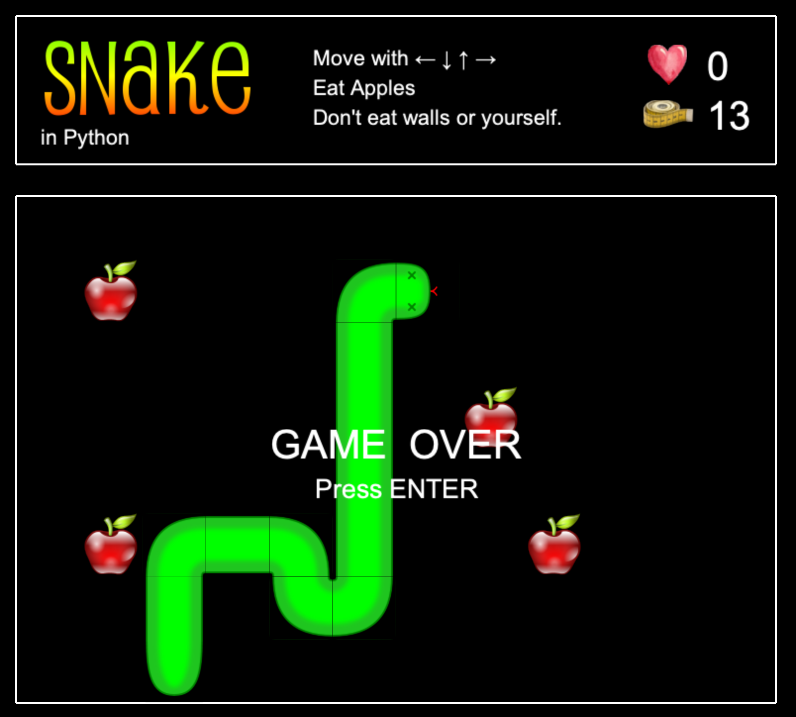

# Snake
Game in Python

Python Game created as study project in [Pyladies course Python for Beginners in Ostrava 2018](https://naucse.python.cz/2018/pyladies-ostrava-podzim/)
### How to play game
1. create and open virtual environment - e.g. for Mac users
    
    `python3 -m venv venv`
    
    `source venv/bin/activate`

2. install requirements

    `pip install -r requirements.txt`

3. run the game

    `python play_snake.py`

